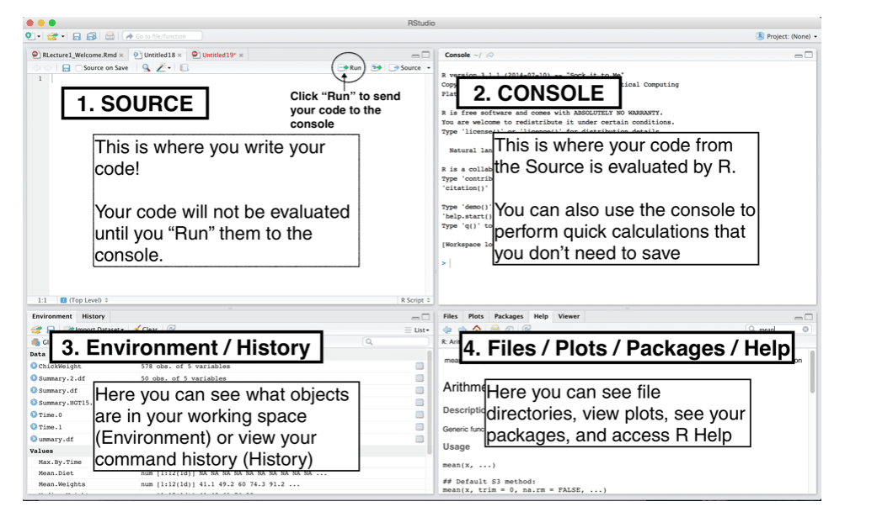

```{r, setup=TRUE, include=FALSE}
knitr::opts_chunk$set(echo = TRUE)
options(dplyr.summarise.inform = FALSE)
library(tidyverse)
library(readxl)
```


## Welcome to Coding Camp! 

- Why are we here?
- What are we going to do?
- A quick introduction to R and RStudio
- How to start working with data

## Teaching Members 

- Instructors
  - Standard Track: Arthur Cheib, Sheng-Hao Lo
  - Accelerated Track: Ari Anisfeld
\newline
- Head TA: Rubina Hundal
  - All logistics issues
\newline
- You will also have several TAs who will be helping you along the way!
  - TA sessions
  - Canvas Discussion Board

## Why learn coding?

- Computation is an essential party of modern-day applied statistics and \textit{quantitative} policy analysis
\newline
- Many public policy jobs and the Harris curriculum rely on programming
  - to quickly engage with policy data
  - to complete statistical analyses
\newline
- Examples
  - Determine how many people are eligible for debt forgiveness
  - Analyze changes in test scores among different groups due to online education
  - What policy problems do you want to tackle with data?

## Gauging your background 

Most of you have some data experience. What are you bringing?

- Excel / Sheets
- Stata
- R
- Python 
- C++? Julia? SPSS? SAS? Other software / languages? 
- Excited for a challenge?

## Why R?

- R is a powerful programming language and statistical software environment
    - Great data manipulation and visualization suite
    - Strong statistical packages (e.g. program evaluation, machine learning)
- Open source and free
- Complete programming language with low barriers to entry

- We will use R for the entire Stats sequence in Fall and Winter

## What will we cover?

0. Motivation/Installation of R *[Today]*
1. Installing Packages and Reading Data *[Today]*
2. Basic Data Manipulation and Analysis *[3]*
3. Data Visualization *[1]*
4. More on Data Manipulation *[3]*
    - Grouped Analysis, Iteration, Functions

- In Stats 1/2 and other courses, you will build off of these lessons:
    - extend your capabilities with the functions we teach you
    - introduce statistics functions
    - introduce new packages and tools based on needs

This is just the beginning of your programming journey!

## Learning philosophy


- We learn coding by experimenting with code

- Coding can be frustrating <!-- I still forget commas and get errors -->

- Coding requires a different modality of thinking 

- We develop self-sufficiency by learning where to get help and how to ask for help

- Coding lab is for you


## How will we progress?

1. Live lectures:

  - Focus on main idea first
  - Try it yourself -- you learn coding by coding!
  
2. Practice in TA sessions (Most important part!):

  - Again -- you learn coding by coding!
  - Break up into small groups and work on problems with peer and TA support
  
3. Additional help:

  - Send emails to Head TA for logistics issues
  - Post questions to Canvas Discussion Board (Teaching team will monitor and reply)
  
4. Final project:

  - It's optional; more details on next slide

## Final project (optional)

  You'll know you're ready for policy school coding, if you can open a data set of interest to you and produce meaningful analysis. For the final project, you will:

  - Pick a data set aligned with your policy interests (or not)
  - Use programming skills to engage with data and make a data visualization showing something you learned from the data
  
## Final project goal

  {}

## Textbooks and Resources
  {}

- Get situated with R for Data Science https://r4ds.had.co.nz/

## Textbooks and Resources
  {}    
        
- Google is your friend for idiosyncratic problems

## Textbooks and Resources
  {}    

- Stack Overflow is your another friend! 
- ... In homework, give credit where it's due.

# Using R and RStudio


## Getting to business

We will

- Discuss what RStudio is
- Introduce minimal information to get started working with R
- Learn different types of operators
- Extending R with packages
- Bringing in data to R

<!-- ## Getting started with R and R Studio -->

<!-- Please install R and R Studio. These are two distinct things! -->

<!-- We have provided information previously.  -->

<!-- On the first day, Harris IT will be available for troubleshooting installations. -->

## Why R *and* RStudio?

R is a language and environment for statistical computing and graphics. 

RStudio is an "integrated development environment" for R. 

In order to use RStudio, you must also have both RStudio and R installed on your computer (R is the “engine” for RStudio)


## Begin Live Demo

- Navigating R Studio
- Rmds and Scripts
- R as calculator

## RStudio basics

- It provides a console to access R directly
- A text editor to write R scripts and work with Rmds
- An environment and history tab that provide useful information about
what objects you have in your R session
- A help / plots / files / packages etc. section 


## RStudio Layout
  {}
(This layout may be different than yours)

## RStudio Layout
  {}    

## Executing commands in R

Three ways to execute commands in R:

1. Type/copy commands directly into the console
2. R scripts (.R files)
  - This is just a text file full of R commands
  - Can execute one command at a time, several commands at a time, or the entire script
3. ‘code chunks’ in RMarkdown (.Rmd files)
  - Can execute one command at a time, one chunk at a time, or “knit” the entire document
  - More on this later


## Using R as a calculator

+, -, *, and /. Also, ^ (Exponent).
```{r}
7 + 5
(4 + 6) * 3 - 2
7 / 5
2^4
```

## Using R as a calculator

- R has many built-in mathematical functions
- To call a function, we type its \textit{name}, followed by parentheses
- Anything we type inside the parentheses is called the function's \textit{arguments}

```{r}
sin(1)   # trigonometric functions
log(1)   # natural logarithm
exp(0.5) # e^(1/2)
sqrt(4)  # square root of 4
```


## End Live Demo

## Try it yourself

1. $30 + 6 \times 5^{8} - log(50) =$ ?
1. $-1^2 * (8 - sqrt(16)) =$ ?
1. $568 \times \frac{135}{log(1)} =$ ?
1. $\frac{15^{0} - 1}{0} =$ ?

```{r eval=FALSE, echo=FALSE}
# answer
30 + 6*5^8 - log(50)
(-1)^2 * (8 - sqrt(16)) # ambiguous (-1)^2 or -1^2
568*135/log(1)
(15^{0} - 1)/0

```

## Try it yourself: Did you get ..


```{r}
# answer
30 + 6*5^8 - log(50)
(-1)^2 * (8 - sqrt(16)) # ambiguous (-1)^2 or -1^2
568*135/log(1)
(15^{0} - 1)/0
```

## Operators can return special values
\footnotesize
`Inf` is infinity. You can have either positive or negative infinity.
```{r}
1 / 0
-5 / 0
```

`NaN` means Not a Number. It's an undefined value.
```{r}
0 / 0
```

`NA` means Missing or Not Available. (More later!)
```{r}
NA + 4
```

## Comparison Operators

These are also binary operators; they take two objects, and give back a \textit{Boolean}

```{r}
7 > 5  # greater than
7 < 5  # less than
7 >= 5 # greater than or equal to
```

## Comparison Operators

```{r}
7 <= 5 # less than or equal to
7 == 5 # equality (two equals signs, read as "is equal to")
7 != 5 # inequality (read as "is not equal to")
```

Notice: `==` is a comparison operator, `=` is an assignment operator

## `&` (and): Return `TRUE` if **all** terms are true.

- TRUE & TRUE -> `TRUE`
- TRUE & FALSE -> `FALSE`
- FALSE & TRUE -> `FALSE`
- FALSE & FALSE -> `FALSE`

```{r}
(5 < 7) & (6 * 7 == 42)
(5 < 7) & (6 * 7 < 42)
(5 > 7) & (6 * 7 == 42)
```

## `|` (or):  Return `TRUE` if **any** terms are true.

- TRUE | FALSE -> `TRUE`
- FALSE | TRUE -> `TRUE`
- TRUE | TRUE -> `TRUE`
- FALSE | FALSE -> `FALSE`

```{r}
(5 < 7) | (6 * 7 < 42)
(5 > 7) | (6 * 7 == 42)
(5 > 7) | (6 * 7 != 42)
```


## Logical Operations

{}    

## Try it yourself

Guess the output of the following codes, and then run the codes to check your answer:
```{r, echo=T, results='hide'}
x <- 6
(x < 9) & (x > 3)
(x < 9) | (x > 7)
(x > 8) | (x > 9)
```

```{r, echo=T, results='hide'}
x = 20
y = 30
(x == 20) & (y == 30)
(x == 20) | (y == 50)
(x + 5^8 - log(50) < 2000000) | (3*y - log(500) == 0)
```


## Basic syntax: Variable assignment

We can think of a variable as a \textit{container} with a name, such as

- `x`
- `stats_score`
- `harris_gpa_average`

Each container can contain \textit{one or more} values


## Basic syntax: Variable assignment

We use `<-` for assigning variables in R. 
```{r}
my_number <- 4
my_number
```

You can also use `=` for assigning variables
```{r}
x = 5
x
```

## Basic syntax: Add comments using the `#` character

- Allow others (and future you) to have an easier time following what the code is doing

```{r}
# comments help us remember ...
my_number <- 4
my_number - 10 # This should be equal to -6
```

- Anything after `#` is ignored by R when executes code

## Variable assignment

We can re-assign a variable as we wish. This is useful if we want to try the same math with various different numbers.
```{r eval=FALSE}
my_number <- 2

sqrt((12 * my_number) + 1) 
```


## Variable assignment: Use meaningful names

We assign all sorts of objects to names including data sets and statistical models so that we can refer to them later.

- **use names that are meaningful**

```{r, eval = FALSE}
# mtcars is a built-in data set, so you can run this locally!
model_fit <- lm(mpg ~ disp +  cyl + hp, data = mtcars)
summary(model_fit)
```


## Using functions

Functions are procedures that take an input and provide an output.

```{r}
sqrt(4)
median(c(3, 4, 5, 6, 7 ))
```

## Function arguments

Function inputs are called arguments. 

Functions know what the argument is supposed to do based on 

- name
- position

```{r, echo = FALSE}
f <- function(x, y) {
      2 * x + y
}
```

e.g. `f` is a function that expects `x` and `y` and returns `2*x + y`

```{r}
# 2 * 7  + 0 = 14
f(7, 0)

# 2 * 0  + 7 = 7
f(y = 7, x = 0)
```


## Finding help with `?`

```{r, eval=FALSE}
?sum
```
\footnotesize
- Description

`sum returns the sum of all the values present in its arguments.`

- Usage  (API)

`sum(..., na.rm = FALSE)`

- Arguments

`...	numeric or complex or logical vectors.`

- Examples (scroll down!)

`sum(1, 2, 3, 4, 5)`


## Review: intro to R and Rstudio

We learned  

- How to navigate RStudio and run R code in the console and scripts
- How to use R operators for math and comparisons
- How to assign names to objects for future enjoyment
- How to use functions and find help with `?`


# Extend R with Packages and Load in Data

## What are packages?

Packages are collections of \textit{functions} and \textit{data sets} developed by the community.

Benefits:

  - Don't need to code everything from scratch (those are powerful tools!)
  - Often functions are optimized using C or C++ code to speed up certain steps


## installing and loading packages
\footnotesize

To use a package we need two steps:

- install/download once from the internet

```{r, eval=FALSE}
install.packages("readxl")  # do this one time
                            # directly in console
```

- load it *each time* we restart R

```{r, eval=FALSE}
library(readxl) # add this to your script / Rmd
                # every time you want to use
read_xlsx("some_data.xls") 
```

- `package::command()` lets you call a function without loading the library

```{r, eval=FALSE}
readxl::read_xlsx("some_data.xls")
```


## common package error

The package 'readr' provides a function to read .csv files called `read_csv()`.
What goes wrong here?

```{r, eval=FALSE}
install.packages("haven")
our_data <- read_csv("my_file.csv")

Error in read_csv("my_file.csv") :
  could not find function "read_csv"
```

## common package error

We need to load the package using `library()`!
```{r, eval=FALSE}
library(readr)
our_data <- read_csv("my_file.csv")
```

We can also use with one line of code:

```{r, eval=FALSE}
our_data <- readr::read_csv("some_data.xls")
```

## `tidyverse`: set of useful packages

Think of the `tidyverse` packages providing a new dialect for R.

```{r, eval = FALSE}
library(tidyverse)
## -- Attaching packages ----------------------------------
## v ggplot2 3.3.0  v purrr   0.3.4
## v tibble  2.1.3  v dplyr   0.8.5
## v tidyr   1.0.2  v stringr 1.4.0
## v readr   1.3.1  v forcats 0.5.0
## -- Conflicts ------------------------------------------
## x dplyr::filter() masks stats::filter()
## x dplyr::lag()    masks stats::lag()
```


## Try it yourself

Say we'd like to conduct data analysis using some powerful tools: 

  - Install the package `tidyverse` 
  - Then import it with the `library()` function
  - Then run the command `storms` directly. What do you get?
```{r, eval=FALSE, echo=FALSE}
install.packages("tidyverse")
library(tidyverse)
storms
head(storms)
```

## So you found some data

Say you find a spreadsheet on the internet and want to start exploring it with R.

Loading data is as easy as

```{r, eval=FALSE}
library(readr)
housing_data <- read_csv("texas_housing_data.csv")
```

This requires that you consider:

  - File type
  - File location
  - Funky formatting
  
## Loading data of various formats

Most common formats and their readers.

file type  | package  | function 
-----------|----------|-------------
.csv        | readr (tidyverse)   | `read_csv()`
.csv        | utils (base R)    | `read.csv()`
.dta (stata)| haven    | `read_dta()`
.xlsx       | readxl   | `read_xlsx()`


## Detour: directory structure

Computer hard drives are organized using a file system. 
In this way, each file has a unique "address" or **file path**. 

  - `~/Documents/coding_lab/texas_housing_data.csv` 

The files are stored in folders or directories which are analogous to "zip codes".

  - `~/Documents/coding_lab/`

In Windows, file paths usually start with `C://...`

## Detour: working directory
\footnotesize
The 'working directory' is the folder in which you are currently working 

  - This is where R looks for files/data


```{r, eval=FALSE}
# If the data is in the same folder as the current working directory
fed_data <- read_xlsx("SCE-Public-LM-Quarterly-Microdata.xlsx")
```
 
 `getwd()` shows your current working directory. 
<!--point out that if they don't know what a directory structure looks like on their computer (windows) they can see it there -->

## Loading Data from original files 

If the data were not in your current working directory, you could:

1. Locate the directory that your file is in
1. Set the directory as the **working directory** 
1. Load the data into R using the correct function

```{r, eval=FALSE}
# After setting the correct directory
library(readr)
setwd("/the/path/to/the/right/folder/")
wealth_data <- read_csv("wealth_data.csv")
```

## Detour: Alternatives
\footnotesize
If the data were not in your current working directory, you could:

- change the current working directory: `setwd("~/Documents/coding_lab")` and use `read_csv("file.csv")`
- give the absolute address: `read_csv("~/Documents/coding_lab/file.csv")`
- give a relative address: `read_csv("coding_lab/file.csv")`
    - this assumes "~/Documents" is the current working directory
- move the file to the current working directory


## Overview of the Data
- `View()`: look at the details of data (`view()` works if tidyverse loaded)
- `glimpse()`: structure of data frame -- name, type and preview of data in each column
- `summary()`: displays min, 1st quartile, median, mean, 3rd quartile and max
- `head()`: shows first 6 rows

```{r, eval=FALSE}
view(wealth_data)
glimpse(wealth_data)
summary(wealth_data)
head(wealth_data)
```

## Attributes of the Data
- `names()` or `colnames()`: both show the names of columns of a data frame
- `dim()`: returns the dimensions of data frame (i.e. number of rows and number of columns)
- `nrow()`: number of rows
- `ncol()`: number of columns

```{r, eval=FALSE}
names(wealth_data)
dim(wealth_data)
nrow(wealth_data)
ncol(wealth_data)
```

## Try it yourself: Dataset `storms`

```{r, eval=FALSE}
# Load dataset
storms
```
- Try `view()`, `glimpse()` and `head()`. What do you see?
- What are the names of all the columns/variables included in `storms`?
- How many rows/observations are included?
- How many columns/variables are included?
```{r, eval=FALSE, echo=FALSE}
view(storms)
glimpse(storms)
head(storms)
names(storms)
nrow(storms)
ncol(storms)
```


## Review: using packages and reading data


We learned

- How to download packages from the internet with `install.packages()`
- How to load packages for use in R with `library()`
- How to distinguish between data formats (csv, xlsx, dta)
- How to navigate the file structure (`getwd()`, `setwd()`)
- How to programatically read data in to R
- How to get basic "see" data 


## Next up

Lab sessions:

- *today*: Review today's material
- *tomorrow*: Learn about Rmds. Load data (for your final project). 

- Progress marker: I can load *relevant* policy data into R. 

Lecture:

- *Thursday*: Vectors + data types & Data in base R