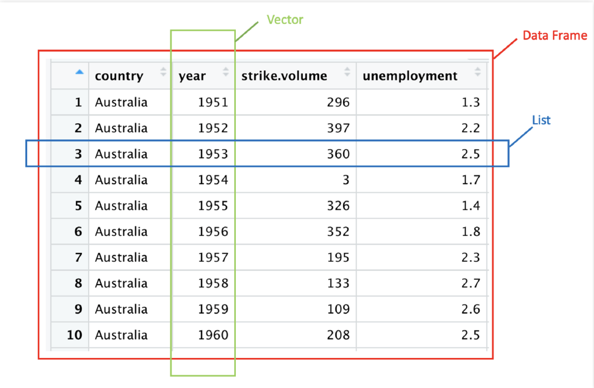

```{r setup, include=FALSE}
knitr::opts_chunk$set(echo = TRUE)
options(dplyr.summarise.inform = FALSE)
library(tidyverse)

```

## Todays class

Build foundational skills with

- Vectors
- Data types
- data.frame and tibble


## Preamble: Data Analysis via Tidyverse and base R

__Tidyverse__ has become the leading way people clean & manipulate data in R

- These packages make data analysis easier than core base R commands
- Tidyverse commands can be more efficient (less lines of code)

\medskip
However, you will inevitably run into edge cases where tidyverse commands don't work the way you expect them to, or where you have to reuse/debug code written in base R ... and hence you'll have to be familiar with __base R__

\medskip
It's good to have a basic foundation on both approaches and then decide which you prefer when conducting data analysis!


# Vectors

## Vectors

Vectors are the foundational data structure in R.  

Here we will discuss how to:

- construct vectors, lists and data frames
- do vectorized math and computations
- deal with missing values (`NA`)
- work with vectors of different data types

## Vectors 

Vectors store an arbitrary^[Within limits determined by hardware] number of items of the *same* type. 

`c()` is used to create a vector with explicitly given items.
  
```{r}
# numeric vector of length 6
my_numbers <- c(1, 2, 3, 4, 5, 6)
my_numbers

# character vector of length 3
my_characters <- c("public", "policy", "101")
my_characters
```


## Vectors 
\footnotesize
In R, nearly every data object you will work with is a vector
```{r}
# vectors of length 1
i_am_a_vector <- 1919
as_am_i <- TRUE

is.vector(i_am_a_vector)
is.vector(as_am_i)
# Some objects are not vectors e.g. functions 
is.vector(mean)
```


## Vectors 

Thus, the `c()` function combines vectors
```{r}
x <- c(c(1, 2, 3), c(4, 5, 6))
x
y <- c(x, 2022)
y
```

## Vectors
There are also several ways to create vectors of *sequential* numbers:
```{r}
too_much_typing <- c(2, 3, 4, 5)
2:5
seq(2, 5)
seq(from = 2, to = 5, by = 1)
```

## Vectors
There are some nice shortcuts for creating vectors:
```{r}
too_much_typing <- c("a", "a", "a", "a")
rep("a", 4)
```


## Try out the following:

Can you explain what is going on?

```{r, eval = FALSE}
rep(c("a", 5), 4)
rep(c("a", 5), each = 4)
```

## Vectors

\footnotesize
Notice how `each` works.


```{r, eval = TRUE}
rep(c("a", 5), 4)
rep(c("a", 5), each = 4)
```

... also notice that 5 is in quotes

## Creating placeholder vectors of a given type 

```{r}
too_much_typing <- c("", "", "", "", "", "")

vector("character", length = 5) 

# or this one.
character(5) 
```


## Creating placeholder vectors of a given type

```{r}
# 1 million 0s
my_integers <- integer(1000000)
head(my_integers)
# 1 million FALSEs
my_lgl <- logical(1e6)
head(my_lgl)
```

## Creating random vectors
\footnotesize
Create *random* data following a distribution (we will be using this many times in Stats 1)
```{r}
# Randomly choose 3 numbers from a Normal distribution
(my_random_normals <- rnorm(3))
# Randomly choose 4 numbers from a Uniform distribution
(my_random_uniforms <- runif(4))
```


The pattern is **r**`distribution` (**r**`unif`, **r**`norm`, **r**`f`, **r**`chisq`)


## Adding elements to an existing vector
```{r}
z <- c("Bo", "Cynthia", "David")
z
z <- c(z, "Ernesto")
z
z <- c("Amelia", z)
z
```


## Accessing Elements by Index

```{r}
z[3]
z[2:4]
```

## Accessing Elements by Index

We can reassign accessed values too.
```{r}
z[1] <- "Arthur"
z[c(1,3)]

```


## Accessing Elements by Index

Using a negative sign, allows subsetting everything *except* the selected one(s):

```{r}
my_letters <- c("a", "b", "c", "d", "e")
# get all numbers besides the 1st 
my_letters[-1]
# get all numbers besides the 4th and 5th
my_letters[-c(4, 5)]
```

## Try it out:

```{r}
a <- 0:9
```

- subset the number 7
- subset all the numbers not equal to 8 or 9
- subset all the even numbers


## Try it out:

```{r}
a[8]
a[-c(9, 10)]
a[c(1, 3, 5, 7, 9)]
```


## Examining Vectors

```{r}
# how many elements does a vector have?
length(a)
# what are the summarys stats?
summary(a)
```

## Vectorized code

Vectorized means do something to a vector **element by element**

- In non-vectorized languages, you use a loop.


## Math is vectorized

Do the operation **element by element**

```{r}
my_numbers <- 1:6
# 1 + 1, 
# 2 + 2, 
# 3 + 3, 
# 4 + 4, 
# 5 + 5, 
# 6 + 6
my_numbers + my_numbers 
```


## Doing math with vectors

Do the operation **element by element** 

- if one vector is "short", recycle it's elements.


```{r}
# 1 + 6, 
# 2 + 6, 
# 3 + 6, 
# 4 + 6, 
# 5 + 6, 
# 6 + 6
my_numbers + 6
```

## Doing math with vectors

Many built-in functions naturally extend to vectors.

- This may remind Excel users of "dragging" a function

```{r}
# sqrt(1)
# sqrt(2)
# sqrt(3)
# sqrt(4)
# sqrt(5)
# sqrt(6)
sqrt(my_numbers)
```


## Try it yourself
\footnotesize
Guess the output before running the codes, and verify the results.

```{r, eval = FALSE}
my_numbers <- 1:6
my_numbers - my_numbers
my_numbers * my_numbers 
my_numbers / my_numbers 
```
  
```{r, eval = FALSE}
a_vector <- rnorm(200) 
sqrt(a_vector) 
round(a_vector, 2)
```

## Warning: Vector recycling
\footnotesize
Be careful when operating with vectors. What's happening here?

```{r, eval = FALSE}
a <- 1:6 + 1:5
a
```

## Warning: Vector recycling
\footnotesize
If vectors are different lengths, the shorter vector re-starts from it's beginning.

```{r, message = FALSE}
# 1 + 1, 
# 2 + 2, 
# 3 + 3, 
# 4 + 4, 
# 5 + 5, 
# 6 + 1 -- '1' is 'recycled'
c(1, 2, 3, 4, 5, 6) + c(1, 2, 3, 4, 5)
```


## Warning: Vector recycling
\footnotesize

```{r, message = TRUE}
# some times we get a warning ...
c(1, 2, 3, 4, 5, 6) + c(1, 2, 3, 4, 5)
```


```{r, message = TRUE}
#  ... but not if vector lengths are multiples
c(1, 2, 3, 4, 5, 6) + c(1, 2, 3)
```

## Binary operators are vectorized

We can do conditional expressions **element by element**!

```{r}
# 1 > 1, 
# 2 > 1, 
# 3 > 3, 
# 4 > 3, 
# 5 > pi, 
# 6 > pi

my_numbers > c(1, 1, 3, 3, pi, pi)
```

## Binary operators are vectorized

We can do boolean logic with vectors **element by element**!

```{r}
my_numbers <- 1:6
# Compare my_numbers with c(4, 4, 4, 4, 4, 4)
my_numbers > 4 
my_numbers == 3 
```

## Accessing Element by Logical Vector

```{r, eval = TRUE}
logical_index <- c(TRUE, TRUE, FALSE, 
                   FALSE, TRUE, FALSE)
```

```{r}
# same as my_numbers[c(1, 2, 5)]
my_numbers[logical_index]
```


## Accessing Element by Logical Vector

```{r, eval = FALSE}
# 1  subset TRUE
# 2  subset TRUE
# 3  subset FALSE
# 4  subset FALSE
# 5  subset TRUE
# 6  subset FALSE
my_numbers[logical_index]
```


## Accessing Element by Condition (i.e. Logical Vector)
```{r}
x <- c(1, 2, 3, 11, 12, 13)
# Choose elements which meet the condition
# c(TRUE, TRUE, TRUE, FALSE, FALSE, FALSE)
logical_index <- x < 10
x[x < 10]
```


## Accessing Element by Condition (i.e. Logical Vector)

```{r}
# Replace elements which meet the condition with 0
x[x < 10] <- 0
x
```


## Functions that reduce vectors

Some functions take a vector and return a summary

  - These are used with `summarize()` 
  
  
```{r, eval=FALSE}
a_vector <- c(1, 3, 5, 7, 9, 11, 13)
sum(a_vector)     # add all numbers 
median(a_vector)  # find the median
length(a_vector)  # how long is the vector
any(a_vector > 1) # TRUE if any number in a_vector > 1
```

  - `paste0()` is a function that combines character vectors
  
```{r, eval=TRUE}
paste0("a", "w", "e", "s", "o", "m", "e")
```

## Functions that reduce vectors

Useful functions to summarize data

- Center: mean(), median()
- Spread: sd(), IQR(), mad()
- Range: min(), max(), quantile()
- Position: first(), last(), nth(),
- Count: n(), n_distinct()
- Logical: any(), all()


# Data Types

## What is going on here?

```{r, eval=FALSE}
a <- "4"
b <- 5
a * b
```

Error in a * b : non-numeric argument to binary operator


## What is going on here?

The error we got when we tried `a * b` was because `a` is a character:

```{r, eval=FALSE}
a <- "4"
b <- 5
a * b # invalid calculation
```

R does not have logic for multiplying character vectors! 

**Wait what's a character vector?**


## Data types

R has four primary types of atomic vectors 
  
  - these determine how R stores the data (technical)
  
  {}
^[Image from https://adv-r.hadley.nz/vectors-chap.html]

## Data types

Focusing on the primary types, we have:

```{r}
# logicals, also known as booleans
type_logical <- FALSE
type_logical <- TRUE

# integer and double, together are called: numeric
type_integer <- 1000
type_double <- 1.0

# character, need to use " " to include the text
type_character <- "abbreviated as chr" 
type_character <- "also known as a string"
```

## Testing types
\footnotesize
```{r}
x <- "1"
typeof(x) # similar result as mode(x) and class(x)
is.integer(x)
is.character(x)
```

\tiny
techincal note: `typeof()` and `mode()` are basically synonyms returning types builtin to R. 
When programs develop new structures the can assign new `class()`, so class allows for more nuanced results.

## Type coercion 

The error we got when we tried `a * b` was because `a` is a character:
```{r, eval=FALSE}
a <- "4"
b <- 5
a * b # invalid calculation
```

We can reassign types on the fly:
```{r}
a <- "4"
b <- 5
as.numeric(a) * b
```

## What Happens When You Mix Types Inside a Vector?
```{r, eval=FALSE}
c(4, "harris")
c(TRUE, "harris")
c(TRUE, 5)
c(FALSE, 100)
```

## Character > Numeric > Logical
```{r}
# Numbers can be coerced into Characters.
c(4, "harris")

# Logicals are coercible to numeric or character. 
c(TRUE, "harris")
c(TRUE, 5)
c(FALSE, 100)
```

## Automatic coercion

We make use of logical coercion a lot.

What do you think the following code will return?
```{r, eval=FALSE}
TRUE + 10
sum(c(TRUE, TRUE, FALSE, FALSE, TRUE))
mean(c(TRUE, TRUE, FALSE, FALSE, TRUE))
```

## Automatic coercion

```{r, eval=TRUE}
TRUE + 10
sum(c(TRUE, TRUE, FALSE, FALSE, TRUE))
mean(c(TRUE, TRUE, FALSE, FALSE, TRUE))
```

## NAs introduced by coercion

R does not know how to turn the string "unknown" into an integer. So, it uses `NA` which is how R represents *missing* or *unknown* values. 

```{r}
as.integer("Unknown")
```

## `NA`s are contagious

`NA` could be **anything** so the output is also *unknown*

```{r}
NA + 4
max(c(NA, 4, 1000))
mean(c(NA, 3, 4, 5))
4 == NA
```

## `NA`s are contagious

We can tell R to ignore the missing values in some functions:

```{r}
b <- c(NA, 3, 4, 5)
sum(b)
sum(b, na.rm = TRUE)
mean(b, na.rm = TRUE)
```


## Testing for `NA` requires a special function

```{r}
x <- 4
x == NA
is.na(x)
!is.na(x)
```

## Vectors require a single type

```{r}
c(TRUE, c(2,2,2), "Last")
```

What do we do we when we want to store different types?

## What do we do we when we want to store different types?
\footnotesize
Use lists! 

Lists are useful building blocks for:

  - data frames / tibbles
  - output from statistical models

```{r}
# vector coercion
typeof(c(1, "a", TRUE)) 
# no-coercion
typeof(list(1, "a", TRUE))
```


## List
\footnotesize
We can name the objects in a list for easy reference.

```{r}
my_list <- list(can = c(TRUE, TRUE), 
                hold = c(2, 2), 
                anything = c("last", "last"))
str(my_list)
```
... Hey that looks like a data frame!

## Lists
\footnotesize
`[[` and `$` pull out a single object from a list by name or location.

```{r}
my_list[[2]]
typeof(my_list[[2]])


my_list$anything
typeof(my_list$anything)
```

## Lists
\footnotesize
We can also subset a `[` list and retain a list

```{r}
my_list[c(1,3)]
# this is still a list
typeof(my_list[c(1,3)])
```

## Lists are vectors?

- lists are still vectors, just not **atomic**
```{r}
is.vector(my_list)
```

{width=50%}

^[image from https://r4ds.had.co.nz/vectors.html]

## Empty list creation

To create an empty list of a given size use `vector()`
```{r}
empty_list <- vector("list", 10)
```


# Data Frames 

## Data Frame vs Vector vs List

\footnotesize
  {}
  
  - Row: holds elements of different types (e.g. numeric, character, logical)
  - Column: store elements of the same type
  

## Data Frame vs Vector vs List

We like `tidy` data where: 
 
  - Row: A distinct observation
  - Column: A feature or characteristic of that observation
 

\footnotesize
  {}
  
  


## Columns are vectors

We can create a tibble or data.frame manually 

- To test out code on a simpler tibble
- To organize data from a simulation

```{r}
care_data <- tibble(
  id = 1:5,
  n_kids = c(2, 4, 1, 1, NA),
  child_care_costs = c(1000, 3000, 300, 300, 500),
  random_noise = rnorm(5, sd = 5)*30
)
```

Could create the same code with `data.frame()`


## Ta-da

Take a look at our data set `care_data`:

```{r}
care_data
```


## Rows are lists

(we make use of this idea less often.)

```{r}
bind_rows(
  list(id = 1, n_kids = 2, child_care_costs = 1000),
  list(id = 2, n_kids = 4, child_care_costs = 3000),
  list(id = 5, n_kids = NA, child_care_costs = 500)
)
```


## Extracting
\footnotesize
Base R ways to pull out a column as a vector:
```{r}
# base R way
care_data$n_kids
# base R way (same result as above)
care_data[["n_kids"]]
```

## Subsetting
\footnotesize
Two base R ways to pull out a column as a tibble/data.frame:

```{r}
care_data["n_kids"]
```

```{r, eval = FALSE}
care_data[2] # recall n_kids is the second column!
```

## Subsetting and extracting

Notice similarity with lists

- `[[` and `$` for extracting (or pulling)

vs.

- `[`  for subsetting / selecting.

\medskip
*Idea: a data frame is a named list with equal length vectors for each object (i.e. columns)*

## subsetting `[]` vs `[,]`

We saw that using `[]` pulls out columns. ("single index")

Using `[ , ]` allows us to  subset rows and columns. ("double index")

`data[` get rows ,  get columns `]`


## Using `[` with two indices

`data[` get rows ,  get columns `]`

```{r}
care_data[c(1, 3), ]
```
```{r}
care_data[, c(1, 3)]
```
## Using `data[` subset rows ,  *subset columns* `]`

We can refer to columns by name or index location.

```{r}
care_data[1:2, c("n_kids", "child_care_costs")]
```

## Using `data[` subset rows ,  *subset columns* `]`

Or even a logical vector. (... this should remind you of vector subsetting!!)

```{r}
care_data[1:2, c(TRUE, FALSE, TRUE, FALSE)]
```

## Using `data[` *subset rows* ,  subset columns `]`

Similarly for rows!

```{r}
care_data[c(1,3), c("id","n_kids")]
```
```{r}
logical_indexing <- c(TRUE, FALSE, TRUE, FALSE, FALSE)
care_data[logical_indexing , c("id","n_kids")]
```

## Using `data[` *subset rows* ,  subset columns `]`

More usual usage for logical indexing

```{r}
logical_index <- care_data$id < 3
care_data[logical_index, c("id","n_kids")]
```

```{r, eval = FALSE}
# put the conditional right into the brackets.
care_data[care_data$id < 3 , "id"]
```


## Let's get you to try. 

First, we need data. 

`us_rent_income` is a practice data set that comes tidyverse.

```{r}
library(tidyverse)
head(us_rent_income)
```


## Testing out  `data[` *subset rows* ,  subset columns `]`

Explore `us_rent_income` quickly with `glimpse()` and `head()`

How would you use a single bracket `[` ...

1. to select the state names and variable columns?
2. to get the rows 1, 3, 5, 7 ?
3. to get all the rows about "income".^[hint: test if *something* `== "income"`?]
4. to get the `variable` and `estimate` columns for rows about Illinois?


## More examples `[`

```{r, include = FALSE}

# 1
us_rent_income[c("NAME", "variable")] # with single indexing
us_rent_income[,c("NAME", "variable")] # with double indexing
us_rent_income[,c(2,3)]

# 2
us_rent_income[c(1,3,5,7),]

# 3
us_rent_income[us_rent_income$variable == "income",]

# 4
us_rent_income[us_rent_income$NAME == "Illinois", c("variable", "estimate")]
```


## Recap

We discussed how to:

- Create vectors, lists and data frames for various circumstances
- Do vectorized operations and math with vectors
- Subset vectors and lists
- Understand data types and use type coercion when necessary


## Next steps

Lab:

- *Today:* Vectorized math
- *Tomorrow:* Using `[` for data analysis

**Touchstone: I can subset and extract from data and vectors with `[`**

Next lecture:

- Using *dplyr* for data exploration! 

(If you want to get ahead go through section 5.1-5.5 of `r4ds.had.co.nz`)

