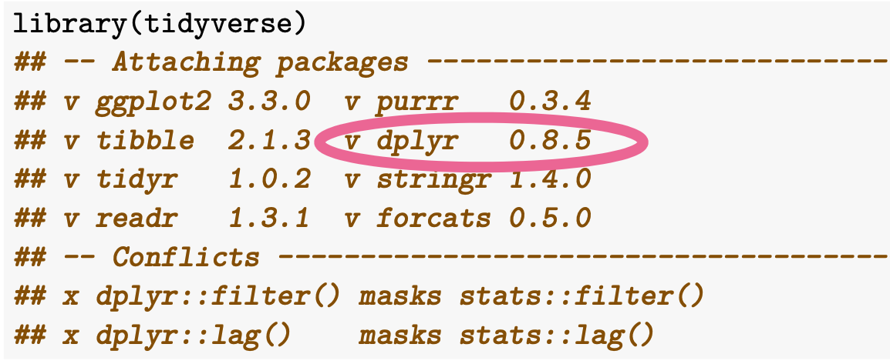
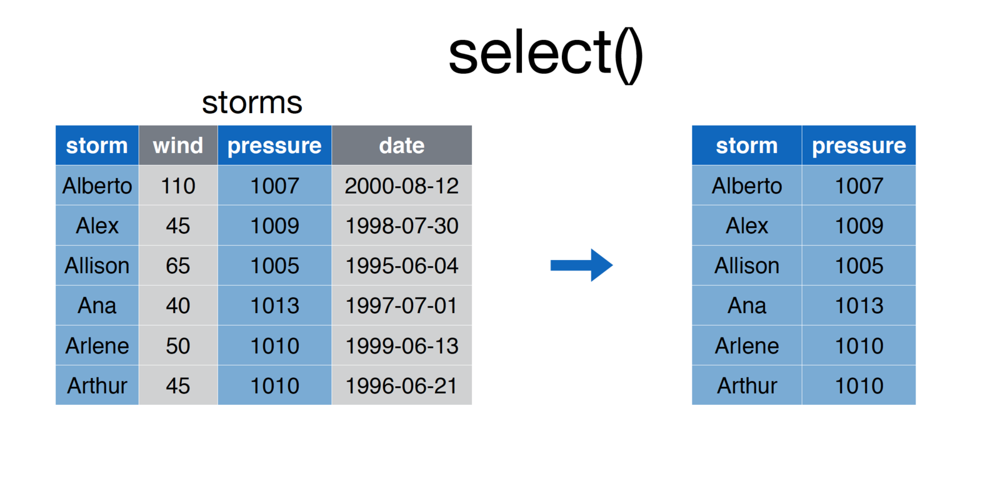
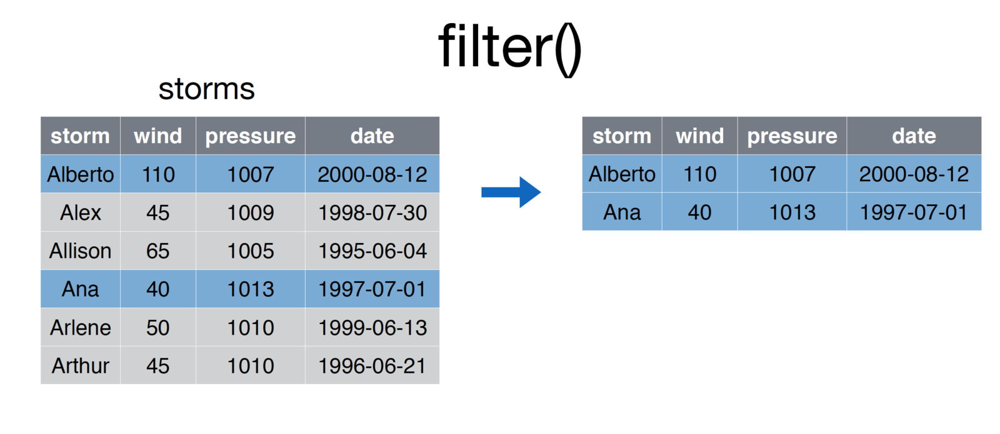
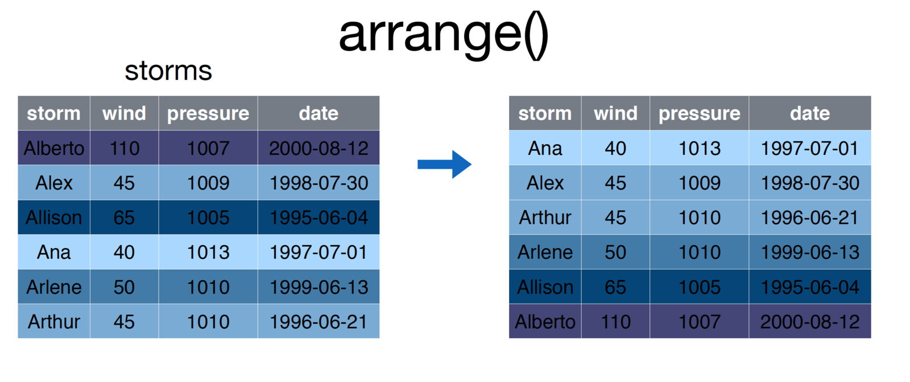
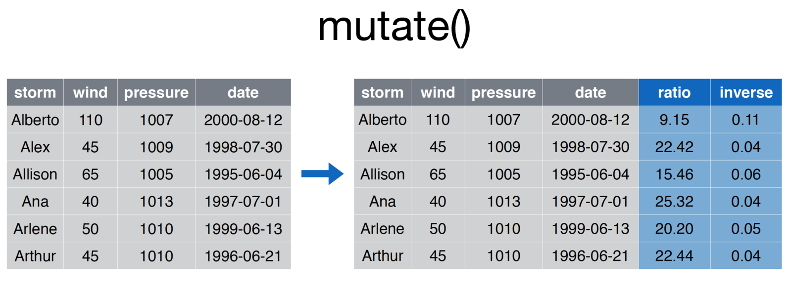
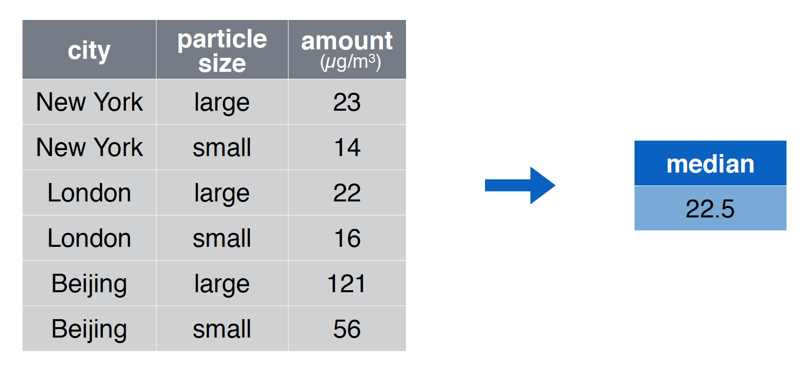

```{r, setup=TRUE, message=FALSE, echo=FALSE}
library(tidyverse)
library(readxl)
options(dplyr.summarise.inform = FALSE)


txhousing_short <- head(txhousing)
txhousing_narrow <- txhousing %>% 
                          select(city, year) %>% 
                          distinct()
txhousing_example <- txhousing %>% 
                          select(city, year, month, sales, volume)
```


# `dplyr`


## Data manipulation with `dplyr`

The `dplyr` library provides a toolkit for data manipulation.

We will cover:

- `select()` to pick columns
- `filter()` to get rows that meet a criteria
- `arrange()` to order the data
- `mutate()` to create new columns
- `summarize()` to summarize data

##  `tidyverse` origins: `dplyr` 




##  `dplyr` concepts

For each function:

- data in the first position
- `...` in the second position (i.e. allows for many changes at once) 


As I show you examples, I'll work with variations of `txhousing` 
`txhousing_short`, `txhousing_narrow` and `txhousing_example`


## selecting columns with `select()` {.build}

{#id .class width=80% height=80%}

## selecting columns with `select()` {.build}
<!-- Unclear how much justice we can do here with the time available. Probably could do a full class on these-->
Use case: You want to present a subset of your **columns**

```{r}
select(txhousing_short, city, date, sales, listings)
```


## think: `select()` extends `[, col_expressions]`

`select` provides a suite of short cuts for selecting columns.

 - Notice that `select` can operate with column names while `[` requires Characters.


```{r}
identical(
  select(txhousing, city, date, sales, listings),
  txhousing[c("city", "date", "sales", "listings")],
)
```


## selecting columns with `select()`

As with `[`, `-` says to exclude the columns listed in the vector.


```{r, eval = FALSE}
select(txhousing_short, -c(city, date, sales, listings))
```

## selecting columns with `select()`


Use case: I want a bunch of columns with similar names.

- There are several useful functions, see `?tidyselect::select_helpers`. 

- (For more information see r4ds chapter 5.4)


```{r, eval = TRUE}
# BaseR requires more coding knowledge
# txhousing[,grep("^city", names(txhousing))]

select(txhousing_short, starts_with("city"))

```


## selecting columns with `select()`, helpers {.build}

Use case: You want to reorder your columns

- Notice we used a "select_helpers" function `everything()`. 

```{r}
select(txhousing_short, 
       date, everything())
```


## choose rows that match a condition with `filter()`

{#id .class width=80% height=80%}

## choose rows that match a condition with `filter()`

Get all the data from 2013
```{r}
filter(txhousing, year == 2013)
```


## think: `filter()` extends `[row_expression, ]`

```{r}
identical(
  filter(txhousing, year == 2013),
  txhousing[txhousing$year == 2013, ]
)
```

Notice that `filter` can operate with column names while `[` requires that you use a vector.


## `filter()` drops comparisons that result in `NA`

Compare:

```{r}
df <- tibble(x = c(1, 2, NA))
filter(df, x > 1)
df[df$x > 1, ]
```


## Recall: Relational operators return TRUE or FALSE

Before moving forward with `filter()`, let's review relational operators and logical operators

| Operator | Name |
|:---------:|:---:|
| < | less than |
| > | greater than |
| <= | less than or equal to |
| >= | greater than or equal to |
| == | equal to |
| != | not equal to |
| %in% | matches something in |

## Recall: Relational operators in practice

```{r}
4 < 4
4 >= 4
4 == 4
4 != 4
4 %in% c(1, 2, 3)
```


## `%in%` operator


Tests if left-hand side is in right-hand side.


```{r}
# 1 %in% c(1, 2, 3, 4)  TRUE
# 5 %in% c(1, 2, 3, 4)  FALSE
c(1, 5) %in% c(1, 2, 3, 4)
```

It operates *element-by-element* on the left-hand side!


## Review: logical operators combine TRUEs and FALSEs logically
\footnotesize
| Operator | Name |
|:---------:|:---:|
| ! | not |
| & | and |
| `|` | or |

```{r}
# not true
! TRUE

# are both x & y TRUE?
TRUE  &  FALSE

# is either x | y TRUE?
TRUE | FALSE
```

## Review: What do the following return? 


```{r, eval = FALSE}
! (4 > 3) 
(5 > 1) & (5 > 2) 
(4 > 10) | (20 > 3)
```


## Review: What do the following return? 

Logical operators team up with relational operators.

 - First, evaluate the relational operator 
 - Then, carry out the logic.
 
```{r, eval = FALSE}
! (4 > 3)             # ! TRUE
(5 > 1) & (5 > 2)     # TRUE & TRUE
(4 > 10) | (20 > 3)   # FALSE | TRUE
```


## Recall: What do the following return? 

```{r, eval = TRUE}
! (4 > 3)             # ! TRUE
(5 > 1) & (5 > 2)     # TRUE & TRUE
(4 > 10) | (20 > 3)   # FALSE | TRUE
```


## choose rows that match a condition with `filter()`

Get all the data from 2013 and beyond for Houston. 

  - in `filter()` additional match criteria are treated like `and`
 
```{r}
  filter(txhousing_narrow, 
         year >= 2013, 
         city == "Houston")
```


## choose rows that match a condition with `filter()`

To do the same operation with `[` ... 

```{r, eval = TRUE}
identical(
  filter(txhousing, 
         year >= 2013, 
         city == "Houston"),

txhousing[txhousing$year >= 2013 &
                   txhousing$city == "Houston", ]
)
```


## Why do we get 0 rows here?

Get all the data from 2013 and beyond for Houston and Austin

```{r}
  filter(txhousing_narrow,
         year >= 2013, 
         city == "Houston", 
         city == "Austin")
```


## choose rows that match a condition with `filter()`


There's no rows where `city` is both Houston AND Austin!

We logically want data from Houston OR Austin

```{r}
  filter(txhousing_narrow,
         year >= 2013, 
         city == "Houston" | city == "Austin")
```

## choose rows that match a condition with `filter()`

At some point you will make this mistake!

```{r, eval = FALSE}
  filter(txhousing_narrow,
         year >= 2013, 
         city == "Houston" | "Austin")
```

```
Error in filter(txhousing, year >= 2013, city == "Houston" | : 
Caused by error in `city == "Houston" | "Austin"`:
! operations are possible only for numeric, logical or complex types
```

## choose rows that match a condition with `filter()`

What if we want data from Houston, Austin OR Galveston

```{r, eval = FALSE}
  filter(txhousing,
         year >= 2013, 
         city == "Houston" | city == "Austin" | city == "Galveston")
```

There has to be an easier way!

## choose rows that match a condition with `filter()`


Use `%in%`!

```{r}
  in_three_cities <- 
    filter(txhousing,
          year >= 2013, 
          city %in% c("Houston", "Dallas", "Austin"))
```


## Warning: `==` with two vectors is a bad idea.

Why does it fail to produce the same result?

```{r}
eq_three_cities <- 
      filter(txhousing,
             year >= 2013, 
             city == c("Houston", "Dallas", "Austin"))

identical(in_three_cities, eq_three_cities)
nrow(in_three_cities)
nrow(eq_three_cities)
```


## Warning: `==` with two vectors is a bad idea.

Why not? Vector recycling.

```{r}
ex <- tibble(id = 1:4,
       attribute = c("a", "a", "b", "b"))

filter(ex,
       attribute == c("a", "c"))
```


## Warning: `==` with two vectors is a bad idea.

Why not? Vector recycling.

```{r}

# a == a
# a == c
# b == a
# b == c

filter(ex, attribute == c("a", "c"))
```


## Crisis averted

```{r}
# a %in% c(a, c)
# a %in% c(a, c)
# b %in% c(a, c)
# b %in% c(a, c)

filter(ex, attribute %in% c("a", "c"))
```


## Introducing the pipe operator


## Interlude: Ceci est une `%>%` {.build}

The pipe `%>%` operator takes the left-hand side and makes it *input* in the right-hand side.

- by default, the left-hand side is the *first argument* of the right-hand side function.

```{r, eval=FALSE}
# a tibble is the first argument
select(txhousing, city, year, sales, volume) 

txhousing %>% 
  select(city, year, sales, volume)
```

## Ceci est une `%>%` {.build}

We can chain together tidyverse functions to avoid making so many intermediate data frames!

- Coming up with names is hard.
- Updating an object repeatedly leads to a buggy development process

```{r}
txhousing %>%
  select(city, year, month, median) %>%
  filter(year == 2013) %>%
  head()
```

## Ceci est une `%>%` {.build}

Read `%>%` as "and then.
```{r, eval = FALSE}
# Take data
txhousing %>%
  # And then select city, year, month and median
  select(city, year, month, median) %>%
  # And then filter where year is 2013
  filter(year == 2013) %>%
  # And then show the head  (i.e. first 6 rows)
  head()
```

## sort rows with `arrange()`

{#id .class width=80% height=80%}

## sort rows with `arrange()`

```{r}

identical(
  # base R
  txhousing[order(txhousing$year), ],
  
  # dplyr
  arrange(txhousing, year)
)
```

## sort rows with `arrange()`

To sort in `desc()`ending order.

```{r}

identical(
  # base R
  txhousing[order(-txhousing$year), ],
  
  # dplyr
  txhousing %>% arrange(desc(year))
)

```


## sort rows with `arrange()`

- arrange can take multiple 

```{r}
txhousing_example %>% 
  arrange(desc(year), month, desc(volume))
```


## in base R


Here's the base R version.

```{r}
  txhousing_example[order(-txhousing_example$year, 
                          txhousing_example$month,
                          -txhousing_example$volume), ]
```


## creating columns with `mutate()` {.build}

{#id .class width=80% height=80%}


## creating columns in Base R

We've hinted at how to add columns in base R. 

What would you guess based on how we added values to lists or changed values in vectors?

## creating columns in Base R

1. Refer to a column with `$`.^[or `[[`]
2. Assign a vector to the name

```{r, eval = TRUE}
# convert the dollar amount to millions
txhousing$volume_millions <- 
  round(txhousing$volume / 1000000, 1)
```


## creating columns in Base R

Since we used an assignment operator. The change is permanent.

```{r}
txhousing %>%
  select(starts_with("volume")) %>%
  head()
```

##  All my x's live in Texas

Vectors of size 1 are recycled.

```{r}
txhousing$state <- "Texas"

head(txhousing[, c("city", "state")])
```


## creating columns with `mutate()` {.build}

`mutate` works like other dplyr verbs

```{r, eval = FALSE}
# the data in the first position 
mutate(txhousing, 
       # after that ... create columns like so
       volume_millions = volume / 1e6)

# same idea 
txhousing$volume_millions <- 
  txhousing$volume / 1e6
```

- As with other dplyr verbs, we can refer to the columns by name


## creating columns with `mutate()` {.build}

```{r}
identical(
# BAD: extracting the column (not as nice)  
txhousing_example %>%
  mutate(volume_millions = txhousing_example$volume / 1e6),

# GOOD: referring to the column by name!
txhousing_example %>%
  mutate(volume_millions = volume / 1e6)
)
```


## creating columns with `mutate()` {.build}

```{r}
txhousing_example %>%
  mutate(mean_price = volume / sales)  %>%
  head()
``` 

## creating columns with `mutate()` {.build}

When we mutate, you can create new columns.

- *Right-hand side*: the name of a new column. 
- *Left-hand side*: code that creates a vector

```{r}
txhousing_example %>%
  mutate(mean_price = volume / sales) %>%
  head()
```
  


## creating columns with `mutate()` {.build}

You can create multiple columns at a single time and even use information from a newly created column as input.


```{r}
txhousing_example %>%
  mutate(mean_price = volume / sales,
         sqrt_mean_price = sqrt(mean_price)) %>%
  head()
```


## creating columns with `mutate()` {.build}

Of course, if you want to change the data, you need to assign the output to a name!

```{r}
texas_housing_again <- 
txhousing_example %>%
  mutate(mean_price = volume / sales,
         sqrt_mean_price = sqrt(mean_price))
```


## Pop quiz
  
If you load `tidyverse`, you can access the `midwest` data 

What dplyr function would you need to ...

- choose the columns `county`, `state`, `poptotal`, `popdensity`
- get the counties with population over a million
- reorder the columns by population total
- round the popdensity to the nearest whole number

## You try it

- `select()` the columns `county`, `state`, `poptotal`, `popdensity`
- `filter()` the counties with population over a million
- `arrange()` the columns by population total
- `mutate()` to round the popdensity to the nearest whole number
- AND `mutate()` to round the population totals to the nearest 1000

if you finish early: Try to write it in base R

```{r, echo = FALSE}
midwest %>%
  select(county, state, poptotal, popdensity) %>%
  filter(poptotal > 1e6) %>%
  arrange(desc(poptotal)) %>%
  mutate(popdensity = round(popdensity),
         poptotal = round(poptotal, -3)
  # alternatively: 
  #      poptotal = poptotal - poptotal %% 1000
  )

```


## solution


```{r, eval = FALSE}
midwest %>%
  select(county, state, poptotal, popdensity) %>%
  filter(poptotal > 1e6) %>%
  arrange(desc(poptotal)) %>%
  mutate(popdensity = round(popdensity),
         poptotal = poptotal - poptotal %% 1000 
  # alternatively: 
  #     poptotal = round(poptotal, -3)
  #      poptotal = poptotal - poptotal %% 1000
  )
```


## solution in base R

```{r}
out <- midwest[midwest$poptotal > 1e6, 
        c("county", "state", "poptotal", "popdensity")]

out$popdensity <- round(out$popdensity)
out$poptotal <- out$poptotal - out$poptotal %% 1000 

out[order(out$poptotal, decreasing = TRUE), ]


```

## solution in base R

- You may also see some base R functions that are antecedents to
  dplyr
  
- (comparison of subset and filter on stackoverflow)[https://stackoverflow.com/questions/39882463/difference-between-subset-and-filter-from-dplyr]

```{r, eval = FALSE}
# subset: filters and selects referring to names
out <- subset(midwest, poptotal > 1e6, 
        c(county, state, poptotal, popdensity))


# within: mutate but with unfortunate syntax 
out <- within(out,{
                popdensity <- round(popdensity)
                poptotal <- poptotal - poptotal %% 1000 
              })

out[order(out$poptotal, decreasing = TRUE), ]


```


## summarize data with `summarize()`



## summarize data with `summarize()`

Calculate total volume of sales in Texas from 2014. 

```{r}
txhousing %>%
  filter(year == 2014) %>%
  summarize(total_volume = sum(volume))
```

## summarize data with `summarize()`

Calculate the mean and median number of sales in Texas's three largest cities. 

```{r}
txhousing %>%
  filter(city %in% 
           c("Houston", "Dallas", "San Antonio")) %>% 
  summarize(median_n_sales = median(sales),
            mean_n_sales = mean(sales))
```

## summarize data with `summarize()`

There are many useful functions that go with summarize. Try `?summarize` for more.

```{r}
txhousing %>%
  summarize(n_obs = n(),
            n_cities = n_distinct(city))
```

## Alert: `summarize()` without summarizing

Weird behavior: 


```{r, eval = FALSE}
# in older versions of dplyr this gives an error
# Error: Column `mean_price` must be length 1 (a summary value), not 561

txhousing %>%
  summarize(mean_price = volume / sales) %>%
  head()
```


## piping `dplyr` verbs together
\footnotesize
`dplyr`verbs can be piped together in any order you want, although different orders can give you different results, so be careful!

```{r, eval = FALSE}
txhousing %>%
  select(city, year, month, sales, volume) %>%
  mutate(log_mean_price = log(volume / sales)) %>%
  filter(year == 2013) %>%
  summarize(log_mean_price_2013 = mean(log_mean_price,
                                       na.rm = TRUE))
  
# Won't give you the same result as 
# txhousing %>%
#  select(city, year, month, sales, volume) %>%
#  mutate(log_mean_price = log(volume / sales)) %>%
#  summarize(log_mean_price = mean(log_mean_price, na.rm = TRUE)) %>%
#  filter(year == 2013)
  
# Actually this code will give you an error, try it!

```
## Recap: manipulating data with `dplyr`

We learned

- how to employ the 5 `dplyr` verbs of highest importance including
  - `select()` to pick columns
  - `arrange()` to order the data
  - `mutate()` to create new columns
  - `filter()` to get rows that meet a criteria
  - `summarize()` to summarize data

- how to use relation operators, binary operators for math and logical operators in `dplyr` contexts


## Next steps:

Lab: 

- Today lab: practice with `dplyr` verbs (and base R manipulation)
- Tomorrow lab: more practice in data manipulation

**Touchstones: I can comfortably manipulate data^[i.e. adjust or add columns to data, subset it in various ways, sort it as needs be and make summary tables.]**


Next lecture: 

- Using `if` and `ifelse`


## Appendix: creating the example data

```{r}

txhousing_short <- head(txhousing)
txhousing_narrow <- txhousing %>% 
                          select(city, year) %>% 
                          distinct()
txhousing_example <- txhousing %>% 
                          select(city, year, month, sales, volume)
```


