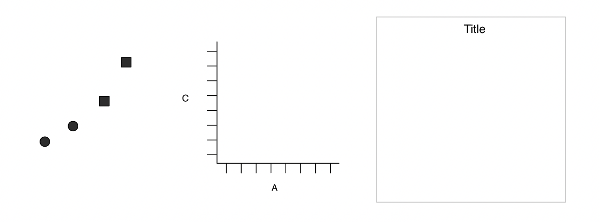
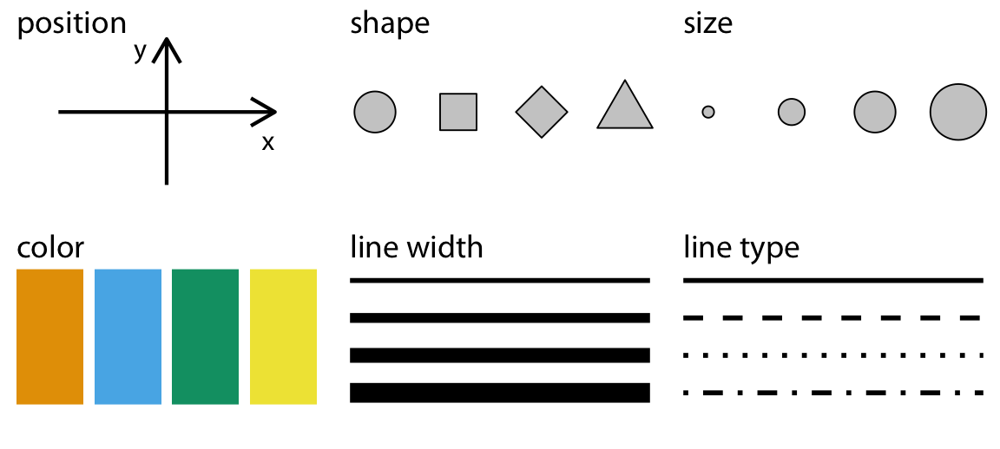
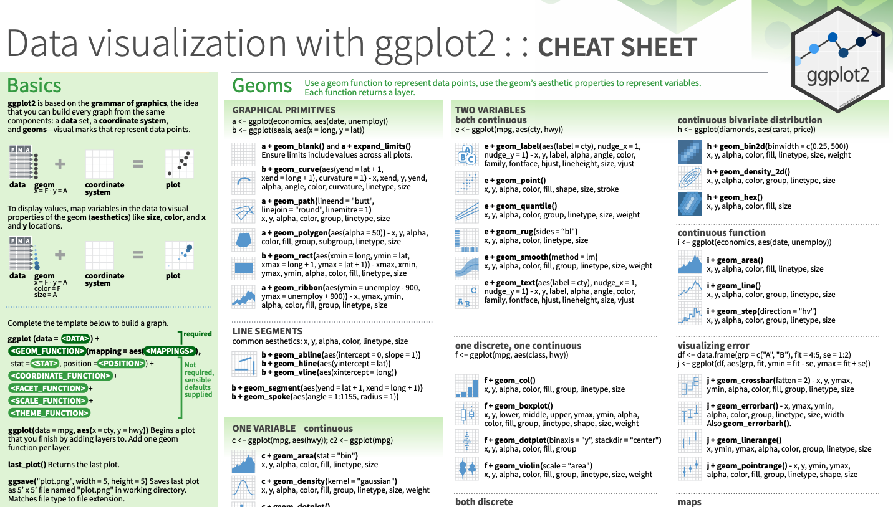
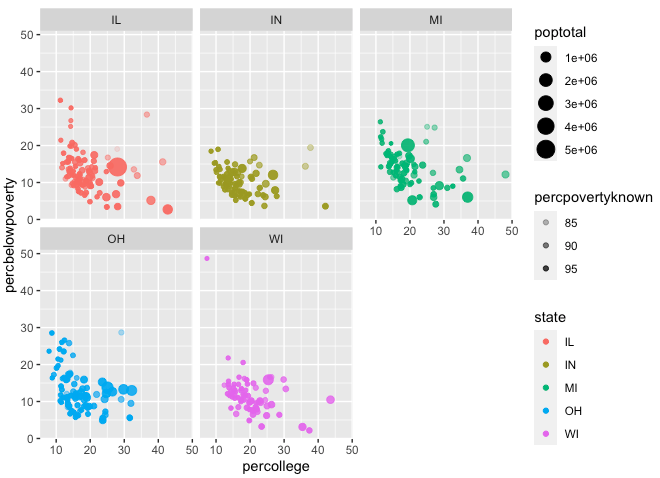
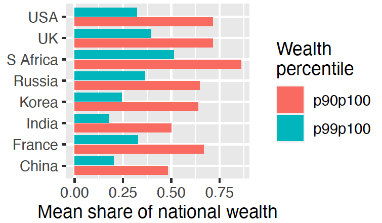
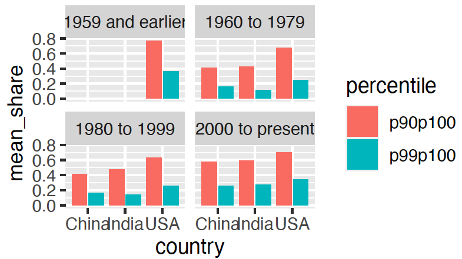

```{r, include = FALSE}
library(tidyverse)
library(readr)
library(maps)
options(dplyr.summarise.inform = FALSE) 
```

## Today's lesson

- Why visualize data?
- How to do so with ggplot
  
  - How to map data to aesthetics with `aes()` (and what that means)
  - How to visualize the mappings with `geom`s 
  - How to get more out of your data by using multiple aesthetics
  - How to use facets to add dimensionality

- Some base R tips


*We have entire courses on data visualization. This is just a sample.*


## Data Visualization: Motivation

Suppose we want to know the following info:

  - How have annual housing sales in Texas changed over time?
  
  - How do these trends compare between cities?
  
## Data Visualization: Motivation
\footnotesize
Is simply looking at all these data helpful?

```{r, echo = FALSE}
 annual_sales <- 
  txhousing %>%
  group_by(year) %>%
  summarize(total_volume = sum(volume, na.rm = TRUE))

annual_sales %>%
  head(10)
```

        
## Data Visualization: Motivation

What if we make a plot of annual housing sales over time...

- Now we can quickly understand and communicate about our data

\medskip

```{r, echo=FALSE}
# prepare new data frame 'annual_sales':
# sum up monthly volume to get annual volume
 annual_sales <- 
  txhousing %>%
  group_by(year) %>%
  summarize(total_volume = sum(volume, na.rm = TRUE))

ggplot(data = annual_sales,
       mapping = aes(x = year, y = total_volume)) +
  geom_point() + geom_line()
```

# Challenge: How do we efficiently communicate how to visualize data to the computer?

## Introducing the "grammar of graphics" and `ggplot`



- `gg` = Grammar of graphics (Wickham 2010, Wilkinson et. al 2005, Bertin 1983)

  - Rules for how to put graph-parts together to make a logical expression
  - Implemented in R with `ggplot2`, a data visualization package in the tidyverse


## Basic Components of `ggplot` (Layers)

<!-- TODO is there a better way to explain this?-->

- Layer 1: Scales and coordinates (`ggplot()`)

  - A data frame
  - Aesthetic mapping: how data are mapped to x-axis, y-axis, color, size, etc

- Layer 2: Geometry  (`geom_xxx()`)

  - geometric objects like points, lines, shapes

- Layer 3: Labels (`labs()`)

  - title, legend, etc
  

## What is Aesthetic?

<!--TODO: Reorder this slide and the previous one? -->

- An aesthetic is a visual property of the objects in your plot

  - Including things like size, shape, color or x and y locations

- To display values, map variables in the data to visual properties of the `geom` (aesthetics)

\medskip




## Simplest `ggplot` code structure

```{r eval=FALSE}
ggplot(data = dataset,
       mapping = aes(x = x_variable,
                     y = y_variable))
  geom_<name>() 
```


##  `ggplot()` tells R to prepare to make a plot.

```{r}
# Let's prepare new data frame 'annual_sales'
annual_sales <- 
  txhousing %>%
  group_by(year) %>%
  summarize(total_volume = sum(volume, na.rm = TRUE))
```

```{r}
# Layer 1, data frame
ggplot(data = annual_sales)
```

## Layer 1: adding an aesthetic `mapping`
\footnotesize
`mapping = aes()` declares how to map the data to "aesthetics":

  - R will map each row of the data (`year`, `total_volume`) to the (`x`,`y`) 
  - i.e. tell R to make x-axis `year` and y-axis `total_volume`

```{r}
ggplot(data = annual_sales,
       mapping = aes(x = year, y = total_volume)) 
```

## Layer 2: visualizing the mapping with `geom`
\footnotesize
Here we see points by using `geom_point()`:


```{r}
ggplot(data = annual_sales,
       mapping = aes(x = year, y = total_volume)) +
  geom_point()
```

## Layer 2: visualizing the mapping with `geom`
\footnotesize
Here we see bars by using `geom_col()`.

- Each *observation* or row has a (`year`, `total_volume`) mapped to the coordinate pair (`x`,`y`)

```{r}
ggplot(data = annual_sales,
       mapping = aes(x = year, y = total_volume)) +
  geom_col()
```

## Layer 2: visualizing the mapping with `geom`
\footnotesize
Here we see a line connecting each (`x`,`y`) pair using `geom_line()`.

```{r}
ggplot(data = annual_sales,
       mapping = aes(x = year, y = total_volume)) +
  geom_line()
```

## Layer 2:  visualizing the mapping with `geom`
\footnotesize
The data can be visualized with different `geoms` that can be composed (`+`) together:

```{r}
ggplot(data = annual_sales,
       mapping = aes(x = year, y = total_volume)) +
  geom_line() +
  geom_point()
```


## Layer 3: Adding labels makes the plot more readable:
\footnotesize
```{r}
ggplot(data = annual_sales,
       mapping = aes(x = year, y = total_volume)) +
  geom_line() +
  geom_point() +
  labs(x = "Year", y = "Annual Volume", 
       title = "Annual Sales in Texas") +
  theme(plot.title = element_text(hjust = 0.5)) #center the title
```


## Over laying multiple `geoms`: adding vertical lines

\footnotesize
```{r}
annual_sales %>%
  ggplot(aes(x = year, y = total_volume)) +
    geom_point() + 
    geom_vline(aes(xintercept = 2007),
                   linetype = "dotted")
```

- add horizontal lines with `geom_hline()`
- add any linear fit with `geom_abline()` by providing a slope and intercept


## aesthetics beyond the `x` and `y`  position 
\footnotesize
We'll use `midwest` data and start with only mapping to `x` and `y`

```{r}
midwest %>%
   ggplot(aes(x = percollege, 
              y = percbelowpoverty)) +
      geom_point()
```

## `ggplot()`: Using `color`
\footnotesize

- `color` maps data to the color of points or lines
  - Each `state` is assigned a color
  - This works with discrete data and continuous data

```{r}
midwest %>%
   ggplot(aes(x = percollege, 
              y = percbelowpoverty, 
              color = state)) +
      geom_point()
```

## `ggplot()`: Using `shape`
\footnotesize
- `shape` maps data to the shape of points
  - Each `state` is assigned a shape
  - This works with discrete data only

```{r}
midwest %>%
   ggplot(aes(x = percollege, 
              y = percbelowpoverty,  
              shape = state)) +
      geom_point()
```

## `ggplot()`: Using `color` + `shape`
\footnotesize
- Combining `color` and `shape`:
  - Each `state` is assigned a shape and color

```{r}
midwest %>%
   ggplot(aes(x = percollege, 
              y = percbelowpoverty,  
              color = state,
              shape = state)) +
      geom_point()
```

## `ggplot()`: Using `alpha`
\footnotesize
- `alpha` maps data to the transparency of points
- we map the percentage of people within a known poverty status to `alpha`

```{r}
midwest %>%
   ggplot(aes(x = percollege, 
              y = percbelowpoverty, 
              alpha = poptotal)) +
      geom_point()
```

## `ggplot()`: Using `size`
\footnotesize
- `size` maps data to the size of points and width of lines.
- we map the percentage of people within a known poverty status to `size`

```{r}
midwest %>%
   ggplot(aes(x = percollege, 
              y = percbelowpoverty, 
              size = poptotal)) +
      geom_point()
```

## `ggplot()`: Using multiple aesthetics together
\footnotesize
We can combine any and all aesthetics, and even map the same variable to multiple aesthetics

```{r, eval = FALSE}
midwest %>%
   ggplot(aes(x = percollege, 
              y = percbelowpoverty, 
              alpha = percpovertyknown,
              size = poptotal,
              color = state)) +
      geom_point()
```

## `ggplot()`: Using multiple aesthetics together

```{r, echo = FALSE}
midwest %>%
   ggplot(aes(x = percollege, 
              y = percbelowpoverty, 
              alpha = percpovertyknown,
              size = poptotal,
              color = state)) +
      geom_point()
```

## `ggplot()`: Facets (`facet_grid`)
\footnotesize
Facets provide an additional tool to explore multidimensional data: 
 
```{r}
midwest %>%
   ggplot(aes(x = log(poptotal), 
              y = percbelowpoverty)) +
      geom_point() +
      facet_grid(vars(state))
```

## `ggplot()`: Facets (`facet_wrap`)
\footnotesize
Facets provide an additional tool to explore multidimensional data: 
 
```{r}
midwest %>%
   ggplot(aes(x = log(poptotal), 
              y = percbelowpoverty)) +
      geom_point() +
      facet_wrap(vars(state))
```

## `ggplot()`: Using aesthetics to explore data
\footnotesize
Different `geoms` have specific aesthetics that go with them. 

 - the ggplot cheatsheet shows all the `geom`s with their associated aesthetics

\medskip

  

## Try it yourself: Plot 1
\footnotesize
1. Adjust code to reproduce the following plot (sample codes provided in the next slide):


```{r, echo=FALSE}
# answer
midwest %>%
  ggplot(aes(x = perchsd, 
             y = percollege)) +
  geom_point()
```
        
## Try it yourself: Plot 1
```{r, eval = FALSE}
midwest %>%
  ggplot(aes(x = ?, 
             y = ?,
            )) + 
  geom_?()
```

```{r eval=FALSE, echo=FALSE}
# answer
midwest %>%
  ggplot(aes(x = perchsd, 
             y = percollege)) +
  geom_point()
```

## Try it yourself: Plot 2
\footnotesize
2. Adjust code to reproduce the following plot (sample codes provided in the next slide):

  {width=95% height=95%}

## Try it yourself: Plot 2
```{r, eval = FALSE}
midwest %>%
  ggplot(aes(x = ?, 
             y = ?, 
             color = state,
             size = ?, 
             alpha = percpovertyknown)) + 
  geom_?() +
  facet_wrap(vars(?)) 
```

```{r, echo=FALSE, eval = FALSE}
# answer
midwest %>%
  ggplot(aes(x = percollege, 
             y = percbelowpoverty, 
             color = state,
             size = poptotal, 
             alpha = percpovertyknown)) + 
  geom_point() +
  facet_wrap(vars(state)) 
```


## discrete vs continuous data

| aes | discrete | continuous |
| --- | -------- | ----------|
| | limited number of classes | unlimited number of classes | 
| |usually `chr` or `lgl` | numeric |
|`x`, `y`| yes | yes |
| `color`, `fill` | yes | yes |
| `shape`| yes (6 or fewer categories) | no |
| `size`, `alpha` | not advised | yes|
| `facet` | yes | not advised |

Here, discrete and continuous have different meaning than in math

- For `ggplot` meaning is more fluid. 
- If there are fewer than 6 to 10 groups, discrete visualizations can work
- If your "discrete" data is numeric, use `as.character()` or `as_factor()` to enforce the decision.

## `color` can be continuous

```{r}
midwest %>%
    ggplot(aes(x = percollege, 
               y = percbelowpoverty, 
               color = percpovertyknown)) +
  geom_point()
```

## `shape` does not play well with many categories
\footnotesize
- Will only map to 6 categories, the rest become `NA`.
- We can override this behavior and get up to 25 distinct shapes

```{r, warning = FALSE}
midwest %>%
    ggplot(aes(x = percollege, 
               y = percbelowpoverty, 
               shape = county)) +
  geom_point() + 
  # legend off, otherwise it overwhelms
  theme(legend.position = "none") 
```

## `alpha` and `size` can be misleading with discrete data

```{r}
midwest %>%
    ggplot(aes(x = percollege, 
               y = percbelowpoverty, 
               alpha = state)) +
  geom_point()
```


## Type of figures

1. Distribution of **univariate (single variable)**

  - bar plot, histogram, density plot, etc
  
2. Relationship between **bivariate (two variables)**

  - scatter plot, line plot, boxplot, (segmented) bar plot, etc
  
3. Relationship between **many variables** at once

  - usually focusing on the relationship between two while conditioning for others

## Univariate: bar plot

```{r, eval = TRUE}
midwest %>%
   ggplot(aes(x = state)) +
      geom_bar()
```

## Univariate: histogram

```{r, eval = TRUE}
midwest %>%
   ggplot(aes(x = percollege)) +
      geom_histogram(binwidth = 1)
```

## Univariate: density

```{r, eval = TRUE}
midwest %>%
   ggplot(aes(x = percollege)) +
      geom_density()
```


## Univariate: box plots

```{r, eval = TRUE, message=FALSE}
midwest %>%
   ggplot(aes(x = percollege)) +
      geom_boxplot()
```


## Bivariate: scatter plot

```{r, eval = TRUE}
midwest %>%
   ggplot(aes(x = percollege, 
              y = percbelowpoverty)) +
      geom_point(size=1)
```

## Bivariate: scatter + smooth Line plot

```{r, eval = TRUE, message=FALSE}
midwest %>%
   ggplot(aes(x = percollege, 
              y = percbelowpoverty)) +
      geom_point(size = 1) +
      geom_smooth()
```

## Bivariate: scatter + smooth Line plot

```{r, eval = TRUE, message=FALSE}
midwest %>%
   ggplot(aes(x = percollege, 
              y = percbelowpoverty)) +
      geom_point(size = 1) +
      geom_smooth(se = FALSE)  # turn off std errors
```

## Bivariate: box plots

```{r, eval = TRUE, message=FALSE}
midwest %>%
   ggplot(aes(x = state, 
              y = percollege)) +
      geom_boxplot()
```


## Recap

- Visualizing our data can help lead to powerful insights between variable relationships

  - Making quick plots helps us understand data and makes us aware of data issues

- `ggplot` starts by mapping data to "aesthetics"

    - e.g. What data shows up on `x` and `y` axes and how `color`, `size` and `shape` appear on the plot
    
- Then, we use `geom`s to create a visualization based on the mapping

- We many consider adding labels to make plots more readable

- There are many ways you can visualize your data!


## Next steps

Labs

- Today: Data visualization with `ggplot` (may run into tomorrow)
- Tomorrow: Introducing plotting in base R

**I can produce basic plots to explore and communicate about data**

Lecture

- Data manipulation and analysis with groups 


## Appendix: Some graphs you made along the way

- Distributions

- Grouped bar graph

- Faceted bar graph

## Appendix: distributions

- `geom_density()` only requires an `x` aesthetic and it calculates the distribution to plot.
- We can set the aesthetics manually, independent of data for nicer graphs.

```{r, eval = FALSE}
    
    chi_sq_samples <-
     tibble(x = c(rchisq(100000, 2), 
                  rchisq(100000, 3), 
                  rchisq(100000, 4)),
            df = rep(c("2", "3", "4"), each = 1e5)) 
    
    chi_sq_samples %>%
      ggplot(aes(x = x, fill = df)) +
      geom_density( alpha = .5) + 
      labs(fill = "df", x = "sample")
```

## Appendix: distributions

```{r,echo = FALSE}
    
    chi_sq_samples <-
     tibble(x = c(rchisq(100000, 1) + rchisq(100000, 1), 
                  rchisq(100000, 3), 
                  rchisq(100000, 4)),
            df = rep(c("2", "3", "4"), each = 1e5)) 
    
    chi_sq_samples %>%
      ggplot(aes(x = x, fill = df)) +
      geom_density( alpha = .5) + 
      labs(fill = "df", x = "sample")
```


## Appendix: grouped bar graph

- `position = "dodge2"` tells R to put bars next to each other, rather than stacked on top of each other.
- Notice we use `fill` and not `color` because we're "filling" an area.

```{r, eval = FALSE}
    mean_share_per_country %>%
      ggplot(aes(y = country, 
                 x = mean_share, 
                 fill = percentile)) +
      geom_col(position = "dodge2") +
      labs(x = "Mean share of national wealth", 
           y = "", 
           fill = "Wealth\npercentile")
```

## Appendix: grouped bar graph

  

## Appendix: faceted bar graph

- Notice that we manipulate our data to the right specification before making this graph
- Using `facet_wrap` we get a distinct graph for each time period.

```{r, eval = FALSE}
     mean_share_per_country_with_time %>%
      ggplot(aes(x = country, 
                 y = mean_share, 
                 fill = percentile)) +
        geom_col(position = "dodge2") + 
        facet_wrap(vars(time_period))
```

## Appendix: faceted bar graph

  