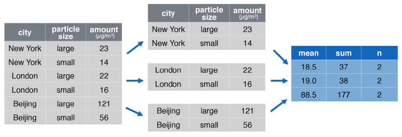

```{r, setup=TRUE, warning=FALSE, message=FALSE, echo=FALSE}
library(tidyverse)
library(readxl)
library(readr)
options(dplyr.summarise.inform = FALSE)
knitr::opts_chunk$set(collapse = TRUE, comment = "#>", highlight = TRUE, fig.align="center")
#knitr::opts_chunk$set(echo = TRUE, fig.align="center")
```

## Grouping data with `group_by()`

Often we want to repeat the same analysis across different subgroups. We can automate that with `group_by()`. We will:

- summarize by group with `group_by()` + `summarize()` 
- create new columns with `group_by()` + `mutate()` 
- `filter()` data with group specific matching criteria


## Grouping data with `group_by()`
\footnotesize
By itself, `group_by()` doesn't do much. But, once an object is grouped, **all subsequent `dplyr` functions are run separately "by group"**:

  -  `count()` returns the number of observations
  
```{r}
txhousing %>% count()
txhousing %>% group_by(year) %>% count() %>% glimpse()
```


## Grouping data with `group_by()`

Ungrouped data ...

```{r}
txhousing %>% glimpse()
```


## Grouping data with `group_by()`

`group_by()` adds meta-data indicating which rows/observations belong to which group.

```{r}
group_by(txhousing, city) %>%  glimpse()
```

## We can group by multiple columns

We now have $46 \text{ cities } \times 16 \text{ years } = 736$ groups!

```{r}
group_by(txhousing, city, year) %>%  glimpse()
```

## Grouped summary with `group_by() %>% summarize()` 

  

In this example, we want to calculate the mean and sum of `amount` by city

  - we must repeat the same analysis across different groups (i.e. cities)
  - Using `group_by() %>% summarize()`  makes it a lot easier!

## Grouped summary with `group_by() %>% summarize()` 
\footnotesize
Let's see the upgrouped summary statistics first:
```{r}
txhousing %>%
  summarize(total_sales = sum(sales, na.rm = TRUE),
            total_volume = sum(volume, na.rm = TRUE),
            mean_house_price = total_volume / total_sales)
```

## Grouped summary with `group_by() %>% summarize()`  
\footnotesize
Use case: You want summary statistics for all subsets (i.e. each year):

  - `summarize()` collapses a data frame to a single row for each group
  - The count function `n()` takes no arguments and returns the size of a group
  
```{r}
annual_housing_prices <- 
  txhousing %>%
  group_by(year) %>%
  summarize(n_within_group = n(),
            total_sales = sum(sales, na.rm = TRUE),
            total_volume = sum(volume, na.rm = TRUE),
            mean_house_price = total_volume / total_sales)

head(annual_housing_prices, n=5)
```

## How have Texas housing prices changed over time?

```{r, fig.width=5, fig.height=2.5}
annual_housing_prices %>% 
  ggplot(aes(x = year, 
             y = mean_house_price)) + 
  geom_line()
```


## Grouped summary with `group_by()` + `summarize()` 
\footnotesize
Use case: You want summary statistics for certain subsets (each year) in a specific city (e.g. Houston):
```{r}
txhousing %>%
  filter(city == "Houston") %>%
  group_by(year) %>%
  summarize(n_within_group = n(),
            total_sales = sum(sales, na.rm = TRUE),
            total_volume = sum(volume, na.rm = TRUE),
            mean_house_price = total_volume / total_sales)
```

## Grouped summary with `group_by()` + `summarize()`
\footnotesize
Use case: You want summary statistics for certain subsets (each year, each city) of the data.
\footnotesize
```{r}
annual_city_housing_prices <- 
  txhousing %>%
    group_by(city, year) %>%
    summarize(total_sales = sum(sales, na.rm = TRUE),
              total_volume = sum(volume, na.rm = TRUE),
              mean_house_price = total_volume / total_sales)
 
head(annual_city_housing_prices, n=5)
```

## How have Texas housing prices changed over time in certain cities?
\footnotesize
```{r, eval=FALSE}
txhousing %>%
  group_by(city, year) %>%
  summarize(total_sales = sum(sales, na.rm = TRUE),
            total_volume = sum(volume, na.rm = TRUE),
            mean_house_price = total_volume / total_sales) %>% 
  filter(city %in% c("Houston",  "Galveston")) %>%
  ggplot(aes(x = year, y = mean_house_price)) + 
    geom_point() + 
    facet_wrap(facets = "city", nrow = 2)
```

## How have Texas housing prices changed over time in certain cities?
```{r, echo=FALSE}
txhousing %>%
  group_by(city, year) %>%
  summarize(total_sales = sum(sales, na.rm = TRUE),
            total_volume = sum(volume, na.rm = TRUE),
            mean_house_price = total_volume / total_sales) %>% 
  filter(city %in% c("Houston",  "Galveston")) %>%
  ggplot(aes(x = year, y = mean_house_price)) + 
    geom_point() + 
    facet_wrap(facets = "city", nrow = 2)
```

## Grouping + Summarizing: Base R vs Tidyverse 
\footnotesize
Base R: 
```{r, eval = FALSE}
# use formula to indicate grouping vars
aggregate(formula = sales ~ city + year,
          data = txhousing,
          FUN = mean)
aggregate(formula = sales ~ city + year,
          data = txhousing,
          FUN = sd)
```

Tidyverse:
```{r, eval = FALSE}
txhousing %>%
  group_by(city, year) %>%
  summarize(mean_sales = mean(sales, na.rm = TRUE),
            sd_sales = sd(sales, na.rm = TRUE))
```

## Ungrouping data
\footnotesize
To get rid of groups, use `ungroup()`

```{r, echo = TRUE}
txhousing_grouped <- group_by(txhousing, year)
```

```{r, eval = TRUE}
txhousing_grouped %>%
  ungroup() %>%
  summarize(total_sales = sum(sales, na.rm = TRUE))
```

## What's going on here?


```{r, message=FALSE}
txhousing_grouped %>%
  select(-year) %>%
  head()
```

## grouped data require the grouping variable

We got the message:
```
Adding missing grouping variables: `year`
```

```{r}
txhousing_grouped %>%
  ungroup() %>%
  select(-year) %>%
  head()
```


## Try it yourself

1. Using  `txhousing`, filter observations where `city` is Brazoria County and group by `year`.  
2. Next, create a variable that represents the total sales in each year.  
3. Plot the total sales over time.
4. Create two variables that represent the sum of missing & non-missing obs for `sales` in Brazoria County.  

  - Whenever you do any aggregation, it’s always a good idea to include either a count of missing values `sum(is.na(x))` or a count of non-missing values `sum(!is.na(x))`. That way, you can check that you are not making conclusions based on very small amounts of data!

```{r, echo=FALSE, eval=FALSE}
# answer to q1, q2 and q3
txhousing %>%
  filter(city == "Brazoria County") %>%
  group_by(year) %>%
  summarize(total_sales = sum(sales, na.rm = TRUE)) %>% 
  ggplot(aes(x = year, 
             y = total_sales)) + 
  geom_point()
```

```{r, echo=FALSE, eval=FALSE}
# answer to q4
txhousing %>%
  filter(city == "Brazoria County") %>%
  group_by(year) %>%
  summarize(
    n_miss_sales = sum(is.na(sales)),
    n_nonmiss_sales = sum(!is.na(sales)))
```

## `group_by() %>% mutate()` creates new columns with groups in mind

\footnotesize
Often we want the "summary" information in the data context.

```{r}
ex <- tibble(period = c(1, 2, 1, 2),
             group = c("a", "a", "b", "b"),
             x = c(3, 1, 11, 13),)

ex %>%
  group_by(group) %>%
  mutate(group_mean = mean(x))
```

## Grouped `mutate`: differences

Use case: You want to work with differences.

```{r}
ex %>%
  group_by(group) %>%
  mutate(x_lag = lag(x),
          x_diff = x - lag(x))
```


## Why is this wrong?

```{r}
ex %>%
  mutate(x_lag = lag(x),
         x_diff = x - lag(x))
```


## Grouped `mutate`: differences

Use case: You want to work with differences. (Try running the code without `group_by()` and carefully compare the results.)

```{r}
july_texas_txhousing <-
  txhousing %>%
    filter(month == 7) %>%
    select(city, year, sales) 

differenced_data <-
  july_texas_txhousing %>%
    group_by(city) %>%
    mutate(last_year_sales = lag(sales),
           diff_sales = sales - lag(sales))
```

## Grouped `mutate`: differences

Use case: You want to work with differences between sales in different years.^[`lag()`'s sibling is `lead()` which will give you data from the following year.]
```{r}
differenced_data %>% head(5)
```

## Grouped `mutate`: other window functions

- See the "Data transformation with dplyr" cheatsheet (page 2) for more vectorized window functions.

```{r}
ex %>%
  group_by(group) %>%
  mutate(cumulative = cumsum(x),
         # comparing values to summaries
         centered = (x - mean(x)))
```


## Grouped `mutate`: ranking

```{r}
ex %>%
  group_by(group) %>%
  mutate(rank = rank(desc(x))) %>%
  arrange(group, rank)
```


## Aside: Grouped `arrange`


Say you want to order the data without explicitly adding a rank.

- Almost all `dplyr` function will operate group-by-group on grouped data.
- `arrange()` is an exception

```{r}
ex %>%
  group_by(group) %>%
  arrange(row_number(desc(x)))
```

## Aside: Grouped `arrange`

However, you only need to add the grouping column(s) or `.by_group = TRUE` to
get the desired output.

```{r, eval = FALSE}
ex %>%
  arrange(group, row_number(desc(x)))
```
```{r}
ex %>%
  group_by(group) %>%
  # this option is nice if you have many grouping cols
  arrange(row_number(desc(x)), .by_group = TRUE)
```


## Grouped `mutate`: ranking

Use case: You want to rank sales within group. (Try running the code without `group_by()` and carefully compare the results.)
```{r}
ranked_data <-
july_texas_txhousing %>%
  group_by(year) %>%
  mutate(sales_rank = rank(desc(sales))) 
```

## Grouped `mutate`: ranking

Use case: You want to rank sales within group.^[R has a variety of related functions see `?ranking`]
```{r}
ranked_data %>% arrange(year, sales_rank) %>% head(10)
```


## Grouped `filter`

Use case: You want to work with the top 5 cities for each year.

```{r}
ranked_data %>%
  # we already added ranks! 
  filter(sales_rank <= 5) %>%
  arrange(year, sales_rank) %>%
  head()
```

## Grouped `filter`

Use case: You want to work with the top 5 cities for each year.

```{r}
july_texas_txhousing %>%
  group_by(year) %>%
  # we don't need sales_rank to filter by ranks!
  filter(rank(desc(sales)) <=  5) %>%
  arrange(year, desc(sales)) %>%
  head()
```

##  `count()` is a useful short cut

Based on what you know about `txhousing`. Can you tell what `count()` does?
```{r}
txhousing %>%
  count(city, year) %>%
  head(5)
```

##  `count()` is a useful short cut
\footnotesize 
`count()` does the following:

  - applies `group_by()` on the specified column(s)
  - applies `summarize()` and returns column `n` with the number of rows per group
  - applies `ungroup()`
```{r}
txhousing %>%
  group_by(city, year) %>%
  summarize(n = n()) %>%
  ungroup() %>%
  head(5)
```

##  `add_count()` is a useful short cut
 
Based on what you know about `txhousing`. Can you tell what `add_count()` does?
```{r}
txhousing %>%
  select(city, year, sales) %>%
  add_count(city, year) %>%
  head(5)
```

##  `add_count()` is a useful short cut
\footnotesize  
`add_count()` does the following:

  - applies `group_by()` on the specified column(s)
  - applies `mutate()` to add a new column `n` with the counts of rows per group while retaining all the other data frame columns
  - applies `ungroup()`
```{r}
txhousing  %>%
  select(city, year, sales) %>%
  group_by(city, year) %>%
  mutate(n = n()) %>%
  ungroup() %>%
  head(5)
```

## Try it yourself: Setup
\footnotesize 
`midwest` is a data set that comes bundled with `tidyverse`. First, let's calculate the total population of Ohio in the following way:

```{r, eval = TRUE}
midwest %>% filter(state == "OH") %>%
  summarize(total_population = sum(poptotal))
```
    
With `group_by`, you can calculate the total population of all the states at once!
    
```{r, eval = TRUE}
midwest %>% group_by(state) %>%
  summarize(total_population = sum(poptotal))
```

## Try it yourself: `group_by()`
\footnotesize 
1. For each state in the `midwest` data, calculate the total `area`.

2. For each state in the `midwest` data, calculate the proportion of counties that are in a metro area (`inmetro`).^[Recall that `mean()` of a column of `0` and `1`s tell you the proportion of `1`s.]

3. Add a column to midwest called `pop_state` that equals the state population. Compare your result to what you calculated early. 

```{r, eval = FALSE}
# fill in the ... with approriate code
midwest %>%
  group_by( ... ) %>%
  mutate(pop_state = ... )
```

```{r, echo=FALSE, eval=FALSE}
# answer to q1
midwest %>%
  group_by(state) %>%
  summarize(total_area = sum(area))
```

```{r, echo=FALSE, eval=FALSE}
# answer to q2
midwest %>%
  group_by(state) %>%
  summarize(prop_in_metro = mean(inmetro))
```

```{r, echo=FALSE, eval=FALSE}
# answer to q3
midwest %>%
  group_by(state) %>%
  mutate(pop_state = sum(poptotal)) 
```

4. Building off the previous question, create a column that shows the number of people living below the poverty line (`percbelowpoverty`) in each county.

```{r, echo=FALSE, eval=FALSE}
# answer to q4
midwest %>%
  group_by(state) %>%
  mutate(pop_state = sum(poptotal),
         pop_below_poverty = pop_state * percbelowpoverty/100)
```

## Try it yourself: `count()`
\footnotesize 
5. Reproduce this table using `count()`.

```{r, echo = FALSE}
midwest %>%
  group_by(inmetro) %>%
  summarize(n = n())
```

```{r, echo=FALSE, eval=FALSE}
# answer
midwest %>%
   count(inmetro)
```
    

## Recap: Analysis by group with `dplyr`

This lesson gave you an idea about how to:

- summarize data by group with `group_by()` + `summarize()` 
- created new columns with `group_by()` + `mutate()` 
  - we saw `lag()` and `rank()`, but you could get 
    also add group-level stats like `mean()` and `median()`
- `filter()` data with group specific matching criteria
- use `count()` and `add_count()` as short cuts for getting group level counts

## Next steps:

Lab:

- Today: Grouped analysis

**I can streamline analysis of subgroup data using group_by() and dplyr verbs**

Lecture:

- Tomorrow: Writing your own functions!